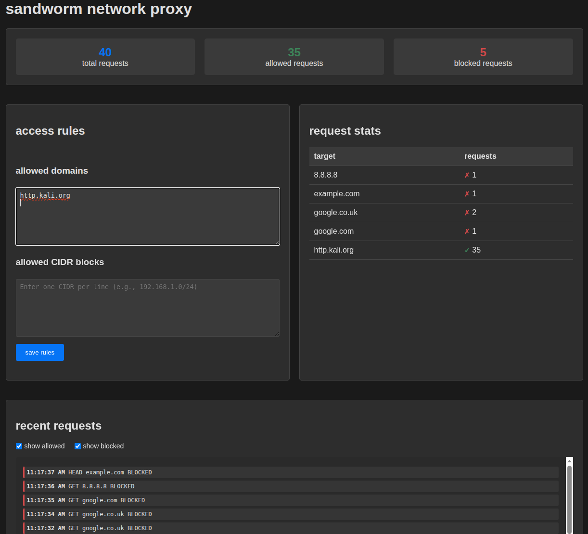

# sandworm

A network proxy for container-based sandbox environments.

## Overview

sandworm is a standalone HTTP/HTTPS proxy server designed to run in containerized environments. It provides configurable domain and CIDR filtering to control network access from sandboxed containers.

Roadmap includes adding support for arbitrary TCP connections.

## Usage

```bash
sandworm --port 2137 --domains "github.com,golang.org" --cidrs "10.0.0.0/8"
```

## Options

- `--port, -p`: Proxy port (default: 2137)
- `--admin, -a`: Enable admin panel (default: false)
- `--domains, -d`: Comma-separated list of allowed domains
- `--cidrs, -c`: Comma-separated list of allowed CIDRs
- `--log-level, -l`: Log level (debug, info, warn, error) (default: info)

## Building

```bash
go build -o sandworm ./cmd/sandworm
```

## Docker

Build the Docker image with the accompanying Dockerfile. For size-optimized builds, there's also a script:

```bash
./build-minimal-image.sh
```

### Official image

https://hub.docker.com/r/poolsideengineering/sandworm

```
docker pull poolsideengineering/sandworm:latest
```

## Low quality ASCII art architecture layout

```
                 ┌─────────┐
                 │  cont2  │
┌─────────┐      └─────┬───┘     ┌─────────┐
│  cont1  │──────┐     │    ┌────┼  cont3  │
└─────────┘      │     │    │    └─────────┘
                 │     │    │
             ┌───▼─────▼────▼──┐
             │ internal network│
             │  172.31.0.0/24  │
             └────────┬────────┘
                      │
             ┌────────▼─────────┐
             │     sandworm     │
             │                  │◄─┐
             └────────┬─────────┘  │
                      │            │
             ┌────────▼─────────┐  │
             │ isolated network │──┘
             │  172.32.0.0/24   │
             └────────┬─────────┘
                      │
                      ▼
                  xxxxxxxxxxx
               xxx       xxxxxxx
              x             xxxxx
             x                 xx
             x  world wide web   x
             x ~~~~             xx
             x~~~~~~~          xxx
             x~~~~~~~          xx
               xx~~~~~~~~~  xxx
                   xxxxxxxxx
```

## Low quality screenshot of the admin panel

Yes, we have one!



